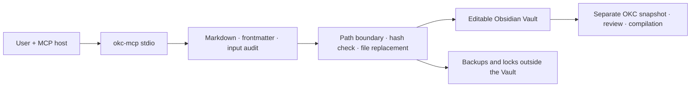

# Initial implementation design

> Unapproved draft. This was written before the Inception review and has not been adopted.
> Construction is currently paused. Follow the [current status](../state.md).

Baseline: `requirements.md`. TypeScript/Node.js 22.13+, MCP SDK 1.30.0 over stdio, YAML 2.9.0, and strict Zod configuration. Existing MCP sources were inspected but no code was copied.

The MCP authors source material; it is not the policy authority for the OKC compiler. `sourceId` belongs to OKC's Vault binding and is not repeated in every note. Folder names and custom fields such as `source` or `status` are authoring conventions. The design does not guarantee that OKC assigns them special meaning.

## Implementation units

1. **Vault I/O**: explicit root; portable relative Markdown paths; exclusion of hidden and control paths; file-type and size checks; UTF-8 reads; deterministic scanning; create without replacement; external backup; `expectedHash`-guarded update; and same-directory temporary-file replacement.
2. **Note quality**: minimal frontmatter generation, CST metadata patches, syntax and format checks, and deterministic heuristic diagnostics for links and duplicates. The tool does not automatically judge whether evidence is true.
3. **Product adapter**: CLI configuration and diagnostics, bounded MCP tools and resources, an authoring prompt, error codes, and bounded JSON responses. In read-only mode, mutating tools are not registered.
4. **Distribution and validation**: lockfile, local tarball, installation in an independent path, real stdio client tests, risk-boundary regressions, AI-DLC history, and requirements traceability.

## Explicit limitations

MCP-to-MCP locking cannot lock Obsidian, Sync, or other editors. The design cannot provide operating-system compare-and-swap against an external write that occurs between the final hash check and file rename. Avoid editing the same note concurrently; after a conflict, read the latest content and review the change again. Node path validation is not a descriptor-relative `openat` sandbox and does not claim complete defense against malicious concurrent replacement of an ancestor directory.

Input auditing does not reproduce the upstream parser. It preserves source Markdown and remains distinct from actual compiler decisions. Default search is a bounded linear literal search and does not guarantee semantic relevance. Validation on large real Vaults, every operating system, and Obsidian Sync conflicts belongs to a separate quality stage.
