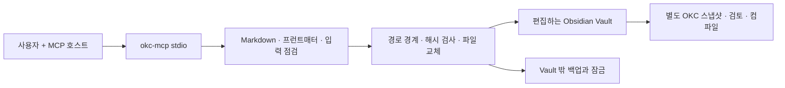

# 첫 구현 설계

> 승인 전 초안. Inception 검토 이전에 작성되었으며 채택되지 않았다.
> 현재 Construction은 중단되어 있다. [진행 상태](../state.md)를 따른다.

기준선: `requirements.md`. TypeScript/Node.js 22.13+, MCP SDK 1.30.0 stdio,
YAML 2.9.0, strict Zod 설정. 기존 MCP 소스는 조사만 했으며 코드를 복사하지 않는다.

MCP는 원본 작성 도구이고 OKC compiler의 정책 주체가 아니다. sourceId는 OKC의
Vault binding에 속하며 모든 노트에 넣지 않는다. folder 이름과 source/status 같은
커스텀 필드는 작성 관습이다. OKC가 특별한 의미로 해석한다고 보장하지 않는다.

## 구현 단위

1. **Vault I/O**: 명시적 root, portable 상대 Markdown 경로, 숨김/제어 경로 제외,
   파일 유형·크기 검사, UTF-8 읽기, 결정적 스캔, create no-replace,
   외부 백업 + expectedHash 기반 update + 같은 디렉터리 임시파일 교체.
2. **노트 품질**: 최소 프런트매터 생성, CST metadata patch, 문법/형식 검사,
   결정적 휴리스틱 링크·중복 진단. 증거의 진실 여부는 자동 판정하지 않는다.
3. **제품 어댑터**: CLI 설정/진단, 제한된 MCP 도구/리소스/작성 프롬프트,
   에러 코드와 bounded JSON 응답. 읽기 전용 설정 시 수정 도구 등록 자체를 생략한다.
4. **배포와 검증**: lockfile, 로컬 tarball, 독립 경로 설치, 실제 stdio client 테스트,
   위험 경계 회귀, AI-DLC 이력과 요구사항 추적.

## 명시적 한계

MCP끼리의 잠금은 Obsidian/Sync/다른 편집기를 잠그지 못한다. 마지막 해시 확인과
파일 rename 사이의 외부 쓰기를 운영체제 CAS로 막지 못한다. 동시에 같은 노트를
편집하는 상황은 피하고 충돌 시 다시 읽고 검토한다. Node 경로 검사는 descriptor-relative
openat 샌드박스가 아니며 악의적인 동시 ancestor 교체를 완전히 방어한다고 주장하지 않는다.

입력 점검은 upstream parser 복제가 아니다. 원본 Markdown은 보존하며 실제 compiler
판정과 구분한다. 기본 검색은 bounded 선형 리터럴 검색이고 semantic relevance를
보장하지 않는다. 실제 큰 Vault·모든 OS·Obsidian Sync 충돌 검증은 별도 품질 단계다.
