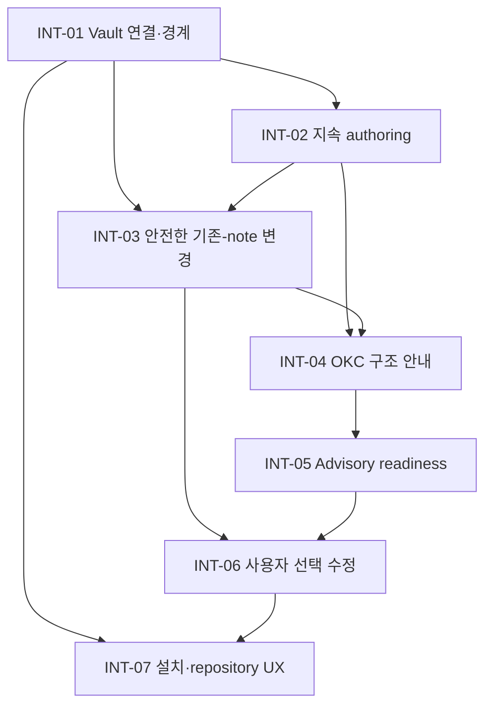

# OKC Local MCP Intent Backlog

**목적:** [`intent-statement`](../intent-capture/intent-statement.md)을 첫 릴리스 capability와 후속 기회로 분해한 proto-Unit backlog  
**우선순위 방식:** MoSCoW + walking-skeleton-first  
**주의:** 이 항목들은 구현 Unit, architecture, API 또는 일정 추정이 아니다.

## 우선순위 원칙

정량 reach, effort, 일정 데이터가 없으므로 RICE나 WSJF 숫자를 만들어내지 않는다. 첫 릴리스 포함 여부는 MoSCoW로 표시하고, Must 항목 안의 순서는 다음 기준으로 정한다.

1. 가장 짧은 사용자 가치 흐름을 end-to-end로 입증한다.
2. 사용자 데이터 손실과 Vault 경계 위험을 기능 확장보다 먼저 낮춘다.
3. OKC 구조 안내와 점검을 안전한 authoring 기반 위에 놓는다.
4. 공개 배포 전 설치·운영·제거 여정을 완결한다.

`Must`는 하나라도 빠지면 확정된 첫 릴리스 경험이 성립하지 않는 capability다. `Should`와 `Could`는 첫 릴리스 gate를 막지 않으며, `Won't Have (this time)`은 명시적인 scope 방어선이다.

## Must Have — 첫 릴리스

| ID | Proto-Unit intent | 사용자 가치 | 선행 intent | 완료 결과 방향 |
|---|---|---|---|---|
| INT-01 | 한 source Vault를 명시적으로 연결하고 실제 경계·허용 동작을 확인한다. | 잘못된 폴더나 Vault 밖에 쓰지 않을 것이라는 신뢰 | 없음 | resolved Vault와 effective policy가 사용자에게 보이고 범위 밖 접근이 거부된다. |
| INT-02 | 기존/MCP 생성 노트를 읽고 검색하며 새 노트 생성과 반복 append를 지속한다. | 한 세션과 이후 세션에 걸쳐 실제 지식이 축적된다. | INT-01 | 작성 결과가 정상 Markdown으로 남고 Obsidian 및 후속 세션에서 확인된다. |
| INT-03 | 의도한 부분만 기존 노트에 적용하고 stale·모호한 변경을 거부한다. | Obsidian에서 한 외부 편집과 원문을 조용히 잃지 않는다. | INT-01, INT-02 | 대상이 명확하고 현재 상태가 맞을 때만 수정되며 충돌은 재시도 가능한 설명으로 끝난다. |
| INT-04 | OKC 확인 제약과 수정 가능한 starter 권고를 구분해 authoring을 안내한다. | 처음부터 근거·metadata·link/MOC가 일관된 Vault를 만들기 쉽다. | INT-02, INT-03 | 사용자는 강제 compiler 규칙으로 오인하지 않고 기본안을 승인하거나 재정의한다. |
| INT-05 | source를 바꾸지 않는 advisory readiness 점검을 제공한다. | OKC에 전달하기 전에 path·frontmatter·link·structure 문제를 발견한다. | INT-04 | 각 finding이 근거와 영향, 수정 가능 여부를 설명하고 compiler 실행 여부를 정직하게 표시한다. |
| INT-06 | 사용자가 선택한 readiness 수정안을 기존 write safety로 적용한다. | 진단이 실제 개선으로 이어지면서 Vault 통제권은 사용자에게 남는다. | INT-03, INT-05 | 선택하지 않은 내용은 유지되고 stale edit은 덮어쓰지 않는다. |
| INT-07 | 공개 repository/package에서 install→connect→first note→diagnose→update/uninstall 여정을 제공한다. | 개인 사용자가 별도 도움 없이 시작하고 유지하며 제거할 수 있다. | INT-01~INT-06의 사용자-facing 계약 | synthetic example과 version/security/troubleshooting 근거가 실제 지원 범위와 일치한다. |

## Should Have — 첫 릴리스 이후 가까운 확장

| ID | Intent | 가치 | 포함하지 않아도 되는 이유 |
|---|---|---|---|
| INT-08 | 기존 Vault 전체의 advisory baseline을 한 번에 요약한다. | 신규 Vault뿐 아니라 기존 Vault 개선의 시작점을 준다. | 대표 첫 고객은 새 Vault 사용자이며, 노트 단위 점검으로 우회할 수 있다. |
| INT-09 | 사용자가 starter 구조와 write scope를 저장·재사용한다. | 반복 세션에서 같은 결정을 줄인다. | 첫 릴리스는 명시적 연결 시 확인으로도 완결될 수 있으며 state 위치 설계가 선행돼야 한다. |
| INT-10 | bounded search의 결과 품질과 큰 Vault 동작을 측정하는 진단을 제공한다. | 영속 index가 필요한지 데이터로 판단한다. | 검색 자체는 INT-02에 포함되며 고급 index는 아직 근거가 없다. |

## Could Have — 근거가 생기면 평가

| ID | Intent | 재검토 신호 |
|---|---|---|
| INT-11 | Obsidian CLI 또는 Local REST API를 통한 app-aware history·UI·rename 보조 | app 실행을 감수할 만큼 명확한 사용자 가치가 확인된다. |
| INT-12 | Vault 밖의 파생 full-text index 또는 semantic retrieval | 대표 Vault에서 bounded search가 측정 목표를 지속적으로 놓친다. |
| INT-13 | Canvas, Bases, attachment에 대한 제한적 읽기·참조 | OKC와 사용자가 각 format의 의미 있는 처리 결과를 정의한다. |

## Won't Have (this time)

| ID | 제외 intent | 경계 근거 |
|---|---|---|
| INT-14 | 삭제, 이동, 이름 변경 | 사용자가 Q2에서 핵심 create/read/search/append/partial-update까지만 첫 버전으로 선택했다. |
| INT-15 | multi-Vault, 원격 공유 server, hosted sync | 승인된 대상은 local-first 개인 사용자와 명시적 단일 Vault다. |
| INT-16 | 실제 OKC compile, pass/fail 판정, approval | authoring MCP와 compiler/approval authority를 분리한다. |
| INT-17 | 임의 shell, provider, 파괴적 파일 operation | 제품 목적과 trust boundary 밖이다. |
| INT-18 | 기존 draft 코드 범위를 제품 범위로 자동 승격 | brownfield 구현은 후속 reverse engineering의 evidence이지 승인된 baseline이 아니다. |

## Walking-Skeleton Delivery Map

| Slice | Backlog coverage | 사용자 demo | confidence hypothesis |
|---|---|---|---|
| VS-1: 첫 지속 노트 | INT-01 + INT-02의 최소 흐름 + INT-07 quick start | 명시적 synthetic Vault에 연결해 기존 note를 읽고 새 note를 만든 뒤 Obsidian에서 확인한다. | local install과 ordinary Vault file persistence가 대표 사용자 여정으로 성립한다. |
| VS-2: 잃지 않는 수정 | INT-03 + INT-02 append/partial update | 같은 note를 계속 개선하고 중간 외부 편집이 있으면 안전하게 멈춘다. | 지속 작성과 conflict safety가 함께 제공될 수 있다. |
| VS-3: OKC-guided authoring | INT-04 + INT-05 | starter 권고로 note를 만들고 advisory readiness 결과를 이해한다. | 일반 Obsidian MCP와 다른 OKC 가치가 사용자에게 보인다. |
| VS-4: 선택적 개선 | INT-06 | finding 중 하나만 선택해 적용하고 나머지와 원문은 유지한다. | guidance가 사용자 통제를 잃지 않고 source 품질을 높인다. |
| VS-5: 공개 릴리스 완결 | INT-07 전체 | clean 환경에서 install, troubleshoot, update/uninstall 경로를 따라간다. | 저장소가 코드 모음이 아니라 자립 가능한 사용자 제품이 된다. |

## 의존성 및 변경 규칙

- Scope 변경은 확정된 Q&A와 이 backlog의 항목 ID에 연결해 기록한다.
- `Could` 또는 `Won't` 항목이 Must 흐름의 선행조건으로 발견되면 조용히 승격하지 않고 사용자에게 scope 결정을 다시 요청한다.
- 후속 Requirements Analysis는 INT-01~INT-07을 검증 가능한 요구사항으로 구체화하되, 이 단계에서 기술 구현을 미리 선택하지 않는다.
- 후속 Units Generation은 이 proto-Unit을 그대로 복사하지 않고 승인된 requirements와 실제 dependency를 사용해 구현 Unit을 도출한다.

## Assumptions & Open Questions

- Assumption: INT-01~INT-07은 고정 날짜가 아니라 검증 가능한 안전성·사용성 결과로 릴리스된다.
- Assumption: public-release 문서화는 마지막 일괄 작업이 아니라 VS-1부터 사용자 여정과 함께 갱신된다.
- Open question: INT-05의 성공 baseline, 목표 감소율 또는 pass rate, 관찰 기간과 측정 표본은 Requirements Analysis에서 정해야 한다.
- Open question: INT-03 충돌 이후 제공할 최소 recovery interaction을 Rough Mockups와 요구사항에서 검증해야 한다.
- Open question: INT-07의 첫 지원 host·platform matrix는 실제 환경 증거 없이 확정할 수 없다.

## Sources

- [`intent-statement`](../intent-capture/intent-statement.md)
- [`scope-definition-questions`](scope-definition-questions.md)
- [`scope-document`](scope-document.md)
- [`competitive-analysis`](../market-research/competitive-analysis.md)
- [`build-vs-buy`](../market-research/build-vs-buy.md)

